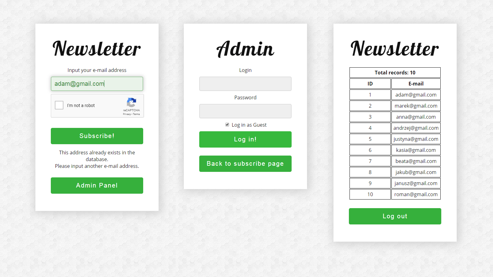

# Learning PHP - PDO library (login, registration, admin panel, newsletter)

> Training course - Pasja Informatyki, PHP course, episode 5 ( [Link](https://www.youtube.com/watch?v=6fn55yrdwkk) )

## General info

Learning PHP. Newsletter subscription page. Admin panel for logging in only for admins. Display all newsletter database entries of users. Using PDO library for connections. Catching exceptions. E-mail, login, password, user in database validation checking. Security code sanitization. Checking if entered e-mail already exists. Fetching a SQL table and displaying it in the browser. Session remembering. Counting the number of total records in the database. Logging out (unsetting session). Inserting a new e-mail into the database.

## Technologies

* HTML5
* CSS
* PHP
* MySQL
* xampp
* phpmyAdmin
* html5shiv 3.7.3
* Google Fonts (Lobster, Open Sans)
* Google reCaptcha v2
* Notepad++
* Microsoft Visual Studio Code

## Screenshot

## Contact

[ReznoRMichael](https://github.com/ReznoRMichael)